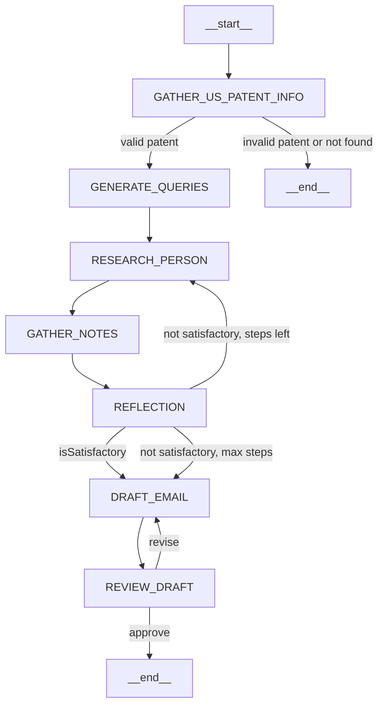

# US Patent Inventor Researcher & Email Draft Agent

This project implements an AI-powered workflow that, given a US patent number, automatically researches the inventors, finds validated contact information, and drafts a professional outreach email. The system leverages LLMs (e.g., GPT-4), web search APIs, enrichment services, and patent metadata to automate lead generation and outreach for intellectual property professionals, researchers, and business development teams.

## Architecture



- **State Management:**
  - The agent's state is managed using [`AgentStateAnnotation`](src/agent/state.ts), which tracks the patent number, patent metadata, search queries, research notes, extracted schema info, reflection results, and email drafts.
- **Core Nodes:**
  - Each node represents a step in the research and outreach process (see [`src/types/index.ts`](src/types/index.ts)):
    - `GATHER_US_PATENT_INFO`: Fetches patent metadata from the PatentsView API. Ends at `GENERATE_QUERIES` (if valid) or `__end__` (if invalid).
    - `GENERATE_QUERIES`: Generates targeted search queries to find inventor information.
    - `RESEARCH_PERSON`: Executes web searches and enrichment to gather inventor details. Loops back to `GATHER_NOTES`.
    - `GATHER_NOTES`: Organizes and extracts structured information from research notes. Leads to `REFLECTION`.
    - `REFLECTION`: Assesses completeness, identifies missing data, and suggests further queries. Conditionally routes to `DRAFT_EMAIL` (if satisfactory or max steps) or back to `RESEARCH_PERSON`.
    - `DRAFT_EMAIL`: Drafts a professional outreach email to the inventor(s). Proceeds to `REVIEW_DRAFT`.
    - `REVIEW_DRAFT`: (Optional) Reviews and finalizes the email draft. Ends at `__end__` (if approved) or returns to `DRAFT_EMAIL` (if revision needed).

## Functionality Overview

1. **Input:** US patent number (optionally with USPTO metadata).
2. **Patent Metadata:** Fetches inventor names, title, abstract, and assignee from PatentsView.
3. **Search & Enrichment:**
    - Generates search queries for the inventor(s).
    - Uses web search APIs to find emails and social links.
    - Disambiguates inventors if multiple patents exist.
4. **Extraction & Reflection:**
    - Extracts structured data (names, emails, links, confidence score) using LLMs.
    - Reflects on missing fields and iterates search if needed.
5. **Drafting:**
    - Drafts a concise, professional outreach email referencing the patent and inventor info.
6. **Output:**
    - Inventor name(s) (with disambiguation)
    - Validated email address(es)
    - Social and professional links (LinkedIn, GitHub, personal site, etc.)
    - Confidence score for match quality
    - Drafted outreach email

## Core Components

- **Graph Definition:** [`src/agent/graph.ts`](src/agent/graph.ts) — Defines the workflow and node transitions.
- **State Management:** [`src/agent/state.ts`](src/agent/state.ts) — Defines tracked data and flow control.
- **Node Logic:** [`src/nodes/`](src/nodes) — Implements each step in the research and outreach pipeline.
- **LLM Prompts:** [`src/agent/prompt.ts`](src/agent/prompt.ts) — Stores prompt templates for each node.
- **Utilities:** [`src/lib/utils.ts`](src/lib/utils.ts) — Includes patent validation, web search, and API helpers.
- **Types:** [`src/types/index.ts`](src/types/index.ts) — Type definitions for state, patent info, and nodes.

## Prerequisites

- Bun installed ([https://bun.sh](https://bun.sh))
- Environment variables for API keys (see `.env.example`)

## Setup

1. **Install Dependencies:**
    ```bash
    bun install
    ```
2. **Environment Variables:**
    - Copy `.env.example` to `.env` and fill in required API keys (Tavily, LLM provider, etc.)
    ```bash
    cp .env.example .env
    ```

## Usage

1. **Run the Agent:**
    ```bash
    bun run index.ts
    ```
2. **(Optional) Studio UI:**
    ```bash
    bun run studio
    ```


## Ideal Use Cases

- Lead generation for IP law, tech transfer, or business development
- Academic or corporate patent research
- Automated outreach to inventors or assignees

---

